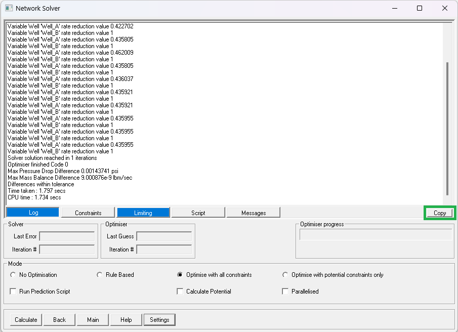

## DESCRIPTION

This script reads a GAP (Petex) solver-optimizer text log and extracts all numerical information, allowing to perform some deeper level of troubleshooting when facing convergence issues.

It's a text parsing script that captures GAP's -cumbersome- logging practices during any timestep.

## CONTENTS
The following folders are included:

**01_Data**: Contains two sample log files. One from a real-world model giving all sorts of headaches (GAP_log_1.txt), and a simple textbook model from IPM samples (GAP_log_ideal.txt).

**02_Code**: Contains the main -and only- Python script (gap_log_analyzer.py) and some pictures for the readme.md file.

**03_Output**: Where I store the resulting plots in *.png format.

## INSTRUCTIONS
The script should work as is, right out of the box. Required packages are the usual suspects (Pandas, Matplolib).

To generate the input log do as follows in GAP:
1. In the Solver and Optimizer parameters, enable the highest level of logging details as shown.

2. After running the solver/optimizer, copy the log into the clipboard by clickling as shown.

3. Paste the clipboard contents into any text editor of your liking and save the file.

To run the script: 

1. Just open the script with your preferred IDE or text editor..

2. There are some basic configuration parameters, namely if you want to save the generated plots to disk, and where would you like to store them.

3. After launching the script you should be asked the path to the log file. In Win11 you can get the full path by right-clicking and "Copy as path".

After that, plots should be generated and you are ready to start with the real engineering and modelling work. :wink:

## FUTURE WORK
While it seems -it is- a very simple script, the amount of structured data it generates is significant and opens the door to additional analyses. Further automating the troubleshooting process seems doable:

1. Correlation analysis aimed to understand how each element in the model affects others (i.e. one well is always choked because another one is opened up...why is GAP choosing specific pairs? what in our input is steering it that way?).
2. Clustering to identify groups of items behaving in a similar pattern, if not evident from a visual inspection or when dealing with very large models.
3. How do our changes in the model improve solver-optimizer performance? Analyzing multiple logs from slightly different models, verifying if our changes are indeed affecting the system the way we intended, or ripples are being created somewhere else.

...and so on. I'll probably do nothing in the end, but sounds clever saying I'll do. :smiley:

As usual, feel free to correct, improve, contribute as you see fit.